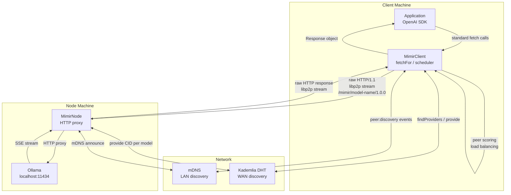
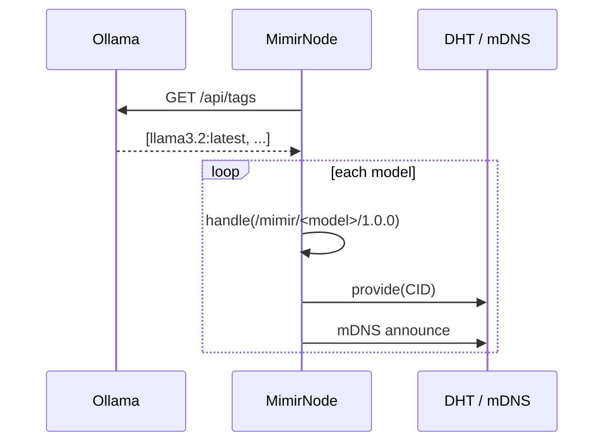
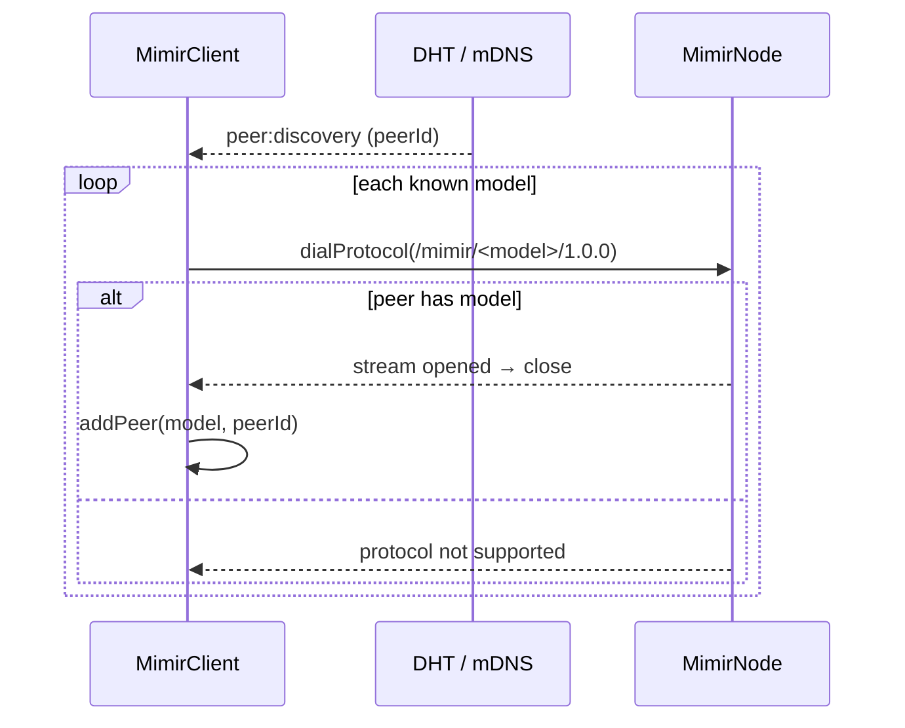
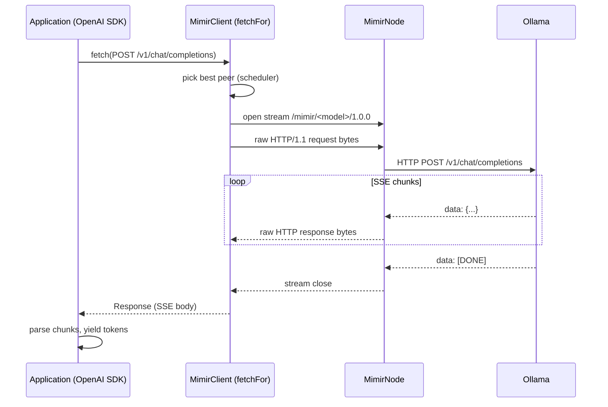

# MimirLLM

MimirLLM is a peer-to-peer transport layer for LLM inference. It handles discovery, routing, scheduling, and tunnelling — the OpenAI SDK does everything else. Any Ollama-compatible client works transparently; Mimir is invisible to application code.

This is a proof-of-concept and is not intended for production use. It is part of the Mimir project, a decentralized AI platform that aims to democratize access to AI models.

## Architecture



## Sequence diagrams

### Node startup & advertisement



### Client discovery & capability probe



### Inference request



## How it works

### Discovery

Nodes advertise each locally available model as a CID on the Kademlia DHT and announce via mDNS. Clients find providers through both channels.

### Capability probing

When a client discovers a peer, it calls `dialProtocol` for each known model protocol (`/mimir/<model>/1.0.0`). A successful dial means the peer has that model. No handshake message needed — libp2p protocol negotiation does the work.

### Tunnelled fetch

`MimirClient.fetchFor(model)` returns a `fetch`-compatible function. Calling it:

1. Picks the best peer via `PeerScheduler` (least active requests, lowest EWMA latency)
2. Opens a libp2p stream using the model's protocol
3. Serialises the HTTP request to raw HTTP/1.1 bytes and writes to the stream sink
4. Reads the raw HTTP response from the stream source
5. Returns a `Response` object — indistinguishable from a real HTTP response

Pass this function to `OllamaClient` as the `fetchFn` parameter. The OpenAI SDK handles streaming, retries, and typed responses.

### Node proxy

`MimirNode` registers one libp2p protocol handler per model. On each incoming stream it:

1. Reads the raw HTTP request bytes
2. Rewrites the URL to target the local Ollama instance
3. Pipes the Ollama SSE response back through the stream

## Usage

### Node

```typescript
import { createLibp2p } from 'libp2p'
import libp2pConfig from './shared/libp2p'
import { MimirNode } from './shared/mimir'

const libp2p = await createLibp2p(libp2pConfig)
const node = new MimirNode(libp2p, {
    ollamaUrl: process.env.OLLAMA_ENDPOINT ?? 'http://localhost:11434',
})
await node.start()
```

### Client

```typescript
import { createLibp2p } from 'libp2p'
import libp2pConfig from './shared/libp2p'
import { MimirClient } from './shared/mimir'
import { OllamaClient } from './shared/mimir/ollama'

const libp2p = await createLibp2p(libp2pConfig)
const mimir = new MimirClient(libp2p)
await mimir.start()

const model = 'llama3.2:latest'
const openai = new OllamaClient('http://ignored/v1', null, mimir.fetchFor(model))

const stream = await openai.chat.completions.create({
    model,
    stream: true,
    messages: [{ role: 'user', content: 'Hello' }],
})

for await (const chunk of stream) {
    process.stdout.write(chunk.choices[0]?.delta?.content ?? '')
}
```

## Installation

```bash
git clone <repo>
cd <repo>
bun install
```

Requires [Ollama](https://ollama.com) running locally on the node machines.

## Backlog
- [ ] Multi-hop routing (client → relay node → GPU node)
- [ ] Token-based incentive layer for node operators
- [ ] Request authentication / peer allowlists
- [ ] Metrics endpoint (Prometheus)
